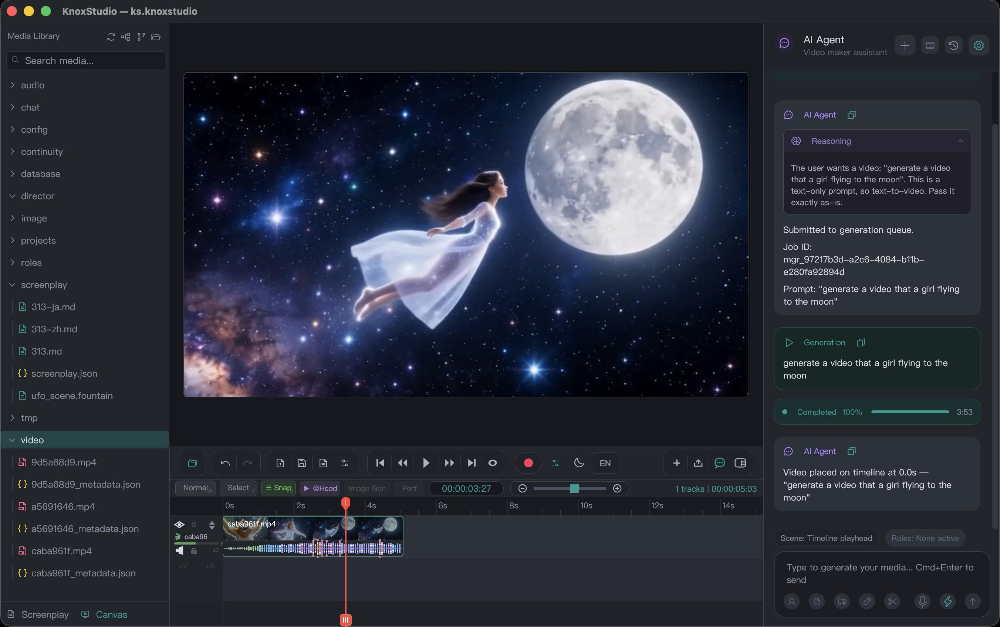

# KnoxStudio

### Record. Edit. Direct with AI. All on your Mac.

KnoxStudio is a professional screen recorder and AI-powered video editor built natively for macOS. Capture your screen, shape it on a real timeline, write screenplays, generate footage with AI, and export polished videos — all inside one fast, beautifully designed app.

Whether you're teaching a course, shipping a product demo, telling a story, or producing content at scale, KnoxStudio takes you from a blank canvas to a finished video without ever leaving your desk.

**Capture it. Shape it. Bring it to life with AI. Then share it with the world.**

|  |
|-|

## Why KnoxStudio?

Most people who make videos juggle a messy stack of tools: one app to record, another to edit, a third for voiceover, a fourth for AI generation, and endless exporting and re-importing in between. It's slow, expensive, and exhausting.

KnoxStudio replaces that entire stack. Recording, editing, audio, annotations, screenwriting, AI generation, AI-directed production, and export all live in one place and talk to each other seamlessly. You stay in flow, your project stays in one piece, and your media never leaves your Mac unless you choose to send it out for AI.

It's built for macOS from the ground up — so it launches fast, stays responsive on long timelines, respects system permissions, and feels at home with keyboard shortcuts, light and dark themes, and a clean interface that gets out of your way.

## Who It's For

- **Educators & course creators** — record lessons, add callouts and numbered steps, and export crisp tutorials.
- **Product & marketing teams** — produce demos, walkthroughs, and social clips quickly and consistently.
- **Content creators & storytellers** — write a screenplay, let AI direct it into shots, and assemble it on a real timeline.
- **Founders & professionals** — explain features, pitch ideas, and share knowledge without hiring a video team.
- **Anyone** who wants studio-quality results without a studio-sized learning curve or budget.

## What You Can Do

### Capture your screen, beautifully

Record any display or window with native macOS capture for sharp, smooth results. Bring in your microphone, your system's audio, and your webcam — each captured cleanly and dropped onto its own timeline track when you stop, so you can adjust, mute, or trim every source independently.

Show your cursor, highlight every click, and style those clicks with elegant **Ring**, **Filled**, or **Spotlight** effects so your audience always knows exactly where to look. What you see in preview is what you get on export.

### Edit on a real, professional timeline

KnoxStudio gives you a true non-linear editing timeline with the tools pros expect — and the ease beginners need.

- **Multi-track editing** for video, audio (microphone and system audio on separate tracks), annotations, and a dedicated camera layer
- **Trim, split, and blade** clips with precision, right at the playhead
- **Drag and drop** clips anywhere, across tracks, with smart snapping to edges, markers, and the playhead
- **Multi-select** with click, Shift-click ranges, Cmd-click, or marquee — including empty gaps — then move whole groups together
- **Group, lock, mute, and color-code** clips to keep complex projects organized
- **Edit modes** — Normal, Ripple, and Insert — that close gaps or push clips aside as you work
- **Gap management** so you can select and remove empty space in a single action
- **Speed control** from slow motion to fast-forward, reverse playback, and freeze frames to hold a moment
- **Detach audio** when you need independent control of picture and sound
- **Transitions** — crossfade, cross dissolve, dip to black or white, wipes, slides, and pushes — with adjustable easing
- **Markers, in/out points, and generous undo/redo** so you can experiment fearlessly
- **Transforms** — position, scale, rotate, and opacity, with keyframes for motion over time

Everything is keyboard-driven if you want it to be. Press **?** anytime for the full shortcut guide and edit at full speed.

### Add annotations that explain

Turn a plain recording into a clear, guided experience. Draw rectangles, ellipses, arrows, lines, and freehand marks. Add text, callouts with pointers, highlights, and numbered steps to walk viewers through a process.

Style everything — colors, opacity, thickness, shadows, rotation — and time each annotation to appear and fade exactly when you need it. Ready-made templates for callouts, lower thirds, intro titles, keyboard hints, and step badges get you a professional look in seconds.

### Make your audio sound right

See waveforms directly on the timeline, balance levels with per-clip and per-track volume, and add smooth fade-ins and fade-outs. Detach audio from video when you need independent control. Apply loudness normalization, ducking, and light noise reduction so your voice stays clear and consistent. Solo and mute tracks to focus while you mix. Choose how clips blend with crossfade, equal-power, full-mix, or hard-cut modes.

### Compose and animate your frame

A multi-layer preview canvas composites your video, camera, and annotations exactly as they'll export. Set your canvas size and background, then position, scale, rotate, and fade any clip. Add keyframes to animate movement, zoom, and opacity over time — bringing motion and emphasis to otherwise static footage.

### Organize your media

Import video, audio, and images by dragging them in. Browse everything in a Media Library with a clear tree view and media preview. Place clips at the playhead or append them to the end of a track. Open screenplays from the same library and keep generated assets, roles, and scripts organized under your KnoxStudio media space.

**Import support includes:**

| Kind | Formats |
|------|---------|
| Video | MP4, MOV, M4V, AVI, MKV, WMV, WebM, FLV, TS, MTS, M2TS |
| Audio | MP3, AAC, WAV, M4A, OGG, FLAC |
| Image | PNG, JPG, JPEG, GIF, BMP, WebP, TIFF |
| Screenplay | Markdown, Fountain, plain text, JSON, YAML |

Projects save as `.knoxstudio` documents you can double-click to reopen. Autosave snapshots, recent files, and missing-media relink help keep long projects safe.

## AI That Works Like a Production Crew

This is where KnoxStudio goes beyond a traditional editor. Built-in AI agents work alongside you as creative collaborators — by text or by voice — wired directly into your timeline, not bolted on as a separate generator.

### Manager Agent — generate media from ideas

Talk to your AI video-maker assistant and ask it to create what you need:

- **Generate video, images, and audio** from prompts, with smart routing to the right model for the job — including text-to-video, image-to-video, and reference-guided generation
- **AI voices and music** for narration, dialogue, sound effects, and soundtracks
- **Continue a scene** from an existing clip, image, or attachment
- **Voice Director** for hands-free direction in realtime
- **@ attachments** so you can hand the agent context from your project
- **Confirm or Auto modes** so you stay in charge of when generations run
- **Chat history** with search, archive, and smart titles — plus generation history and cost awareness

Results land on your timeline ready to trim, arrange, and polish.

### Editor Agent — edit the timeline in plain language

Describe the edit you want, and the Editor agent performs real timeline operations — the same kinds of moves a skilled human editor would make:

- Split, trim, move, delete, retime, duplicate, copy, cut, and paste
- Adjust opacity, volume, fades, transforms, and transitions
- Detach audio, freeze frames, lock or group clips, ripple-delete ranges, and insert space
- Move the playhead, change selection, and manage tracks (add, remove, rename, mute, solo, lock, volume)
- Extract frames or detect key moments and place them as stills
- Insert media from an attachment, a path, or your Media Library
- Regenerate a clip, create a variation, or extend footage from what's already on the timeline

Because the agent can **see** your footage and **hear** what's said, you can ask for edits grounded in content:

- *"Remove the silences"*
- *"Cut on every scene change"*
- *"Cut to where she says…"*
- *"Caption this clip"*
- *"Slow this down"* (uses your current selection)

Destructive actions use Confirm mode and approval cards so nothing important disappears without your say-so. If you edit manually while the agent is working, its changes wait for your approval instead of overwriting your work.

### Director Mode — from screenplay to finished sequence

Hand Director Mode a prompt or a full screenplay and it plans the production:

1. **Analyze** the story into a shot list with framing, camera, and timing
2. **Review** the interactive shot list — edit prompts and durations before anything generates
3. **Generate** shot by shot, with continuity awareness between clips
4. **Validate**, skip, retry, or regenerate individual shots as needed
5. **Place** the finished sequence on your timeline

Director Mode understands dialogue length, chains exit frames into the next shot for visual continuity, and can watch previous footage so successive shots feel connected — not like a pile of disconnected clips.

### Screenplay workspace — write where you produce

Write, outline, and read inside the same app as your timeline. Switch between **Canvas** and **Screenplay** tabs, enter focus mode for distraction-free writing, and use templates for features, shorts, and TV episodes.

- AI writing assistance when you want a collaborator on the page
- Local version history for your scripts
- Role chips on scenes that map characters to Character Roles
- One-click **Add to timeline** for generated scene media
- **Send to Director Mode** to turn a script into a planned production
- Export screenplays to HTML or Final Draft (FDX)

### Character Roles & continuity

Keep your cast consistent across every generated shot:

- **Character Roles** with reference images or video and voice profiles
- Active / inactive role control so scenes use the right cast
- **Continuity sequences** that chain frames, environment, and motion across a multi-shot run
- Sequence progress, ETA, shot previews, and desktop notifications when a run finishes
- **Send to Timeline** to drop a completed sequence onto a new track in one click

### Variations — pick the best take

Generate multiple AI takes, compare them side by side, and choose **Use** on the one that wins. Creative decisions stay yours; the agent just multiplies your options.

## Export Anywhere

When you're done, export exactly what you need — with annotations, click effects, transforms, transitions, and your full multi-track mix rendered faithfully.

| Format | Best for |
|--------|----------|
| **MP4 (H.264)** | Universal sharing and upload |
| **MP4 (H.265 / HEVC)** | Smaller files at high quality |
| **ProRes (MOV)** | High-quality masters and further editing |
| **WebM (VP9)** | Web delivery |
| **Animated GIF** | Short loops and lightweight previews |
| **MP3** | Audio-only export |
| **WAV** | Lossless audio-only export |

Choose resolution presets up to **4K**, a percentage of the source, or a custom size. Dial in bitrate and quality (fast / normal / slow). Built-in presets cover common goals — Screen Tutorial 1080p, Course Master 4K, Web Preview 720p, Animated GIF Small, Audio MP3, and Audio WAV — and you can save your own. Filenames follow your project name, progress shows ETA, and output is verified after export so you can publish with confidence.

## What Makes It Different

| Advantage | What it means for you |
|-----------|------------------------|
| **All-in-one studio** | Record, edit, annotate, write, generate, direct, and export without switching apps |
| **AI on a real timeline** | Not a separate generator — agents perform pro edits and place footage where it belongs |
| **Screenplay → Director → Continuity → Timeline** | A writers'-room-to-finished-sequence pipeline in one place |
| **Vision- and speech-aware editing** | Cut on scene changes, remove dead air, or edit by what was said |
| **Character Roles & continuity** | Consistent cast, look, and flow across multi-shot AI productions |
| **Privacy-respecting** | Media lives on your Mac; API keys stay in the macOS Keychain; AI only runs when you configure and use it |
| **Native macOS experience** | Permissions, shortcuts, notifications, Universal Binary (Apple Silicon & Intel), dark & light themes |
| **You stay in control** | Confirm / Auto modes, approval cards for destructive edits, and hold-for-approval if you edit mid-run |
| **Reliable by design** | Autosave with rotating snapshots, crash and recording recovery, project integrity checks, and export verification |
| **Ready for everyone** | English and Simplified Chinese, approachable UI with pro depth underneath |

## Getting Started

1. **Install KnoxStudio** on your Mac (macOS 13 or later, Apple Silicon or Intel).
2. **Launch the app** and follow first-run setup — language, theme, media engine check, and permissions for Screen Recording, Camera, and Microphone as needed.
3. **Pick how you want to begin:**
   - **Record** your screen, camera, microphone, and system audio
   - **Import** existing video, audio, or images by dragging them in
   - **Create with AI** by describing what you want — or write a screenplay and let Director Mode build it
4. **Edit on the timeline** — trim, arrange, annotate, and mix until it feels right. Or ask the Editor agent in plain language.
5. **Polish in the preview** with transforms, keyframes, transitions, and click effects.
6. **Export and share** in the format and quality that fits your audience.

Press **?** anytime inside the app for the full keyboard shortcut list.

### AI setup (optional)

To use Manager, Editor, Director, and generation features, add your [KnoxChat API key](https://knox.chat) in Preferences. Models and capabilities update from the live KnoxChat catalog so you always see what's available. Your keys are stored securely in the macOS Keychain.

## Languages, Themes & Accessibility

- **English** and **Simplified Chinese** throughout the app
- **Dark** and **Light** themes (including high-contrast variants)
- Full keyboard navigation and VoiceOver-friendly labels
- In-app shortcut overlay so power users never have to leave the keyboard

## System Requirements

| | |
|--|--|
| **Platform** | macOS 13.0 or later |
| **Hardware** | Apple Silicon |
| **Permissions** | Screen Recording (to capture); Camera and Microphone as you use them |
| **Projects** | `.knoxstudio` document packages |
| **Updates** | In-app update checks from official releases; signed and notarized distribution |

## Acknowledgments

KnoxStudio uses **FFmpeg** for media processing. FFmpeg is free software licensed under the [LGPL 2.1 or later](https://www.ffmpeg.org/legal.html). See the About dialog and bundled license materials in the app for details.

## The Bottom Line

KnoxStudio gives you a complete video studio on your Mac — the recorder, the editor, the audio booth, the writers' room, and an AI production crew, all working together. It removes the friction, the app-switching, and the cost that usually stand between an idea and a finished video, so you can spend your energy on what you actually want to say.

**Capture it. Shape it. Bring it to life with AI. Then share it with the world.**

*Welcome to [KnoxStudio](https://knoxstudio.ai).*
